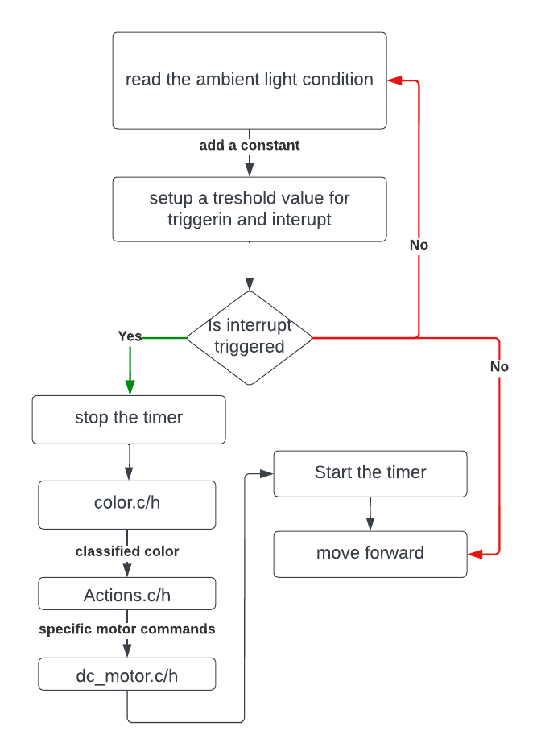
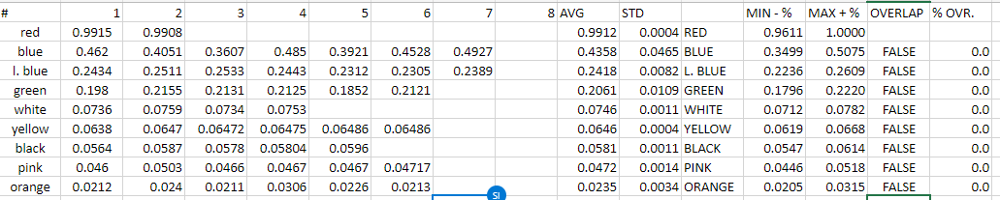

# Course project - Mine navigation search and rescue 
This repository contains code for a small robots that needs to navigate a maze based on a different flags and then retreive its steps back to the base.
## Table of contents
- [Video](#video)
- [Instructions](#instructions)
- [Code](#code)
	- [Color](#color)
	- [Interupts](#interupts)
	- [Actions](#actions)
	- [Timers](#timers)
	- [Motors](#motors)
## Video
[](http://www.youtube.com/watch?v=L3bw5WM81Qs)

## Instructions 
After flashing the code onto the hardware our experiments indicated that it is important to;
1. recalibrate the color detection threshold for a different light sensor
2. check the battery voltage and ideally always work with the same one
3. clear the wheels from any dust or debris
4. configure power supplied to the left and right motors
5. setup the number of cycles needed to perform a 45 degrees turn 

## Code 
Once the code starts and after initialization our main loop executes the following flow diagram:



### Color
In order to sense the cards color the follwing steps are perfomed:
1. use and interrupt to trigger color reading
2. get colour values from the sensor, this is done with I2C comunicatioc
3. average the normalized value from the sensor
5. convert RGB readigns to HSL scale
6. classify what color the HSL value coresponds to

#### Interupts
A interupt is genrated when the clear sensor, senses a value above ambient. This is calibrated on each run so that if light gets darker as we go into the maze we will still drive to the wall correctly.
```c
int Interrupts_distance_calibrate(void){
    //function takes ambient light at start up and adds 100 to this value
    int clear;
    RGB_val colour;                        // declares one new structure of RGB value type 
    color_readColorValues(&colour);
    clear = colour.W;
    clear = clear + 200;
    return clear;
}
```
Once a interupt is triggered the global variable at_wall is set to 1, this enters the code into the main while loop. This is a low priority interupts as the timer is using the high priority interupt.
```c
void __interrupt(low_priority) LowISR()
{
    if(PIR0bits.INT0IF){
        at_wall = 1;
        color_disableInterrupts();         //otherwise reading values will not be possible
        color_turnOffInterruptsFlag();      // clear the flag and turn interrupts off
        PIR0bits.INT0IF = 0;             //clear the flag in the buggy
    }       
}
```
#### Reading values from color sensor
Once the clear interrupt is triggered the I2C communication transmits the data from the Clear, Red, Green and Blue and saves it to a color structure. 

The RGB structure is shown here:
```c
//definition of RGB structure
typedef struct RGB_val { 
	unsigned int R;
	unsigned int G;
	unsigned int B;
    unsigned int C;
} RGB_val;
```
#### Average results for a better performance
Then calculations are done based on these read values.
```c
int iter = 20;                         //integration time is 101ms i.e. 200x0.101 = 20.2s
    
    for (int counter = 0; counter < iter; counter++) 
    {
        color_readColorValues(ptr_to_colour); //each loop pool new reading
        
        float Red_Ratio     = (float) ptr_to_colour->R / ptr_to_colour->W;
        float Green_Ratio   = (float) ptr_to_colour->G / ptr_to_colour->W;
        float Blue_Ratio    = (float) ptr_to_colour->B / ptr_to_colour->W;
        
        float Hue           = _RGB_To_Hue(Red_Ratio, Green_Ratio, Blue_Ratio);
        sumHue = sumHue + Hue;
    }
    float avgHue = sumHue / iter;

```

#### Converting from RGB to HSL

To receive a scale which is simpler to adjust (only one value of Hue is needed) and more human friendly we convert our raw readings from RGB to HSL. This adopted from the online code from MikroElektronika, the supplier of the sensor (https://github.com/MikroElektronika/Color_click/blob/master/library/__color_driver.c)

#### Color Classification
For each color we gather 7 reading inf different light settings. 
.
We then take the min and max values of our readings add a 4% margin of error (ensouring that there are no overlaps between different colors) and we bundle them together. For this we define a pair (min, max):
```c
struct pair {
        float min;
        float max;
    };

```
which is then used by a bigger struct with all of min-max ranges:
```c
  struct pair pairs_array[] = {
        [red]           =  {0.9611,     1},
        [blue]          =  {0.3499,     0.5075},
        [light_blue]    =  {0.2236,     0.2609},
        [green]         =  {0.1796,     0.2220},
        [white]         =  {0.0712,     0.0782},
        [yellow]        =  {0.0619,     0.0668},
        [black]         =  {0.0547,     0.0614},
        [pink]          =  {0.0446,     0.0518},
        [orange]        =  {0.0205,     0.0315}
    }; 
```
please note that our colors are defined as enums, which makes it easier to add new colors (as count track is automaticaly genereated with enums.
```c
enum color_flags {red, blue, light_blue, green, white, yellow, black, pink, orange, repeat} colors;
```
Lastly, to qualify where our color lie we loop our structure of limits for different colors flags
```c
for (int i = 0; i < number_of_colors; i++){
        if ((pairs_array[i].max > color_value) && (pairs_array[i].min < color_value)) 
            return i;
    }
     return 10; //if nothing is found return error

```
Creating continous intervals over the spectrum of HSL color above the interrupt trigger is incorrect. Consider that sometimes even averaged readings might be inaccurate (say car run low on batter and is approaching our cards slower than it should). In our approach we mitigate for this by creating a fixed interval and error flag that forces the system to repeat measurement if it was carried incorrectly.

### Actions

The return function is an implementation of the stack data structure or first-in-first-out (FIFO) approach. This is advantageous since we always want to access the top element of the array. It has also computation complexity of $O(1)$ for extracting or saving elements c.f. $O(n)$ for sorting through the array.
The stack is defined as a structure:
```c
typedef struct struct_stack{
    int stack[number_of_action];               //array to store past values
    int top;                               //after first action you will start at
    int time[number_of_action];
} action_stack;
```
We implement this by defining push (adding values) and pop (removing) actions. 
```c
void memory_pushAction(int action, action_stack *a_stack) { //increase the pointer
    a_stack->stack[a_stack->top] = action; //save the most recent action
}

void memory_pushTime(int time, action_stack *a_stack) { //increase the pointer
    a_stack->time[++a_stack->top] = time; //save the most recent action
}

int memory_popAction(action_stack *a_stack) {
    int top = a_stack->stack[a_stack->top]; //save the most recent action
    return top;
}

int memory_popTime(action_stack *a_stack) {
    int time_top = a_stack->time[a_stack->top--]; //save the most recent action
    return time_top;
}
```
As well as a function to tell us when the stack is empty
```c
int stack_empty(action_stack *a_stack) {
    int empty;
    if (a_stack->top == -1) {
        empty = 1;
    } else {
        empty = 0;
    }
    return empty;
}
```
The buggy will return home if a white or black card is read, this is acheived through our return function where we extract the values from the stack. (reversing some of the buggy actions)
```c
void buggy_makeReverseActions(DC_motor *mL, DC_motor *mR, action_stack *stack) {
    while (!stack_empty(stack)) {
        switch (memory_popAction(stack)) {
            case red:
                reverse(mL,mR); // reverse half a square
                __delay_ms(100);
                // turn left 90
                turn(mL, mR, 90, 0); // 1 is right 
                break;
                ...
```
After the reverse of the action has been perfomed, the buggy will then reverse for the required time according to how long it drove in the first place. 
```c
        second = 0;
        int run_time = memory_popTime(stack);
        while (second <= run_time) {
            fullSpeedReverse(mL, mR, speed);
        }
        stop_slow(mL, mR);
        reverse_to_parallel(mL,mR); // ram into wall to make parrell
```
### Timers
The timer is always runing and incrementing. This is done through a high priority interrupt. Where the global variable second is incremented every time the timer overflows.
```c
void __interrupt(high_priority) HighISR()
{
    if(PIR0bits.TMR0IF){
        // increase the timer by 1 second
        PIR0bits.TMR0IF = 0;    //clear the flag at start so counter starts straight away in the buggy
        second = second + 1;    // increase the second count
    }      
}
```
Then when the buggy hits a wall the timer is stopped and this drive time is pushed to memory.
```c
while (!end) {
        while (at_wall) { 
        memory_pushTime(second, &a_stack);                  //begin with pushing the time that have hit the flag
```
Before the buggy start moving again the timer is set to zero
### Motors
Motors are controlled by changing the values in the DC_motor structure, this is done by passing a pointer to to a motor control function. The motor control functions contain loops to ensure that the current to the motor changes gradually. The buggy ligths break lights also turn on when it is stopping. For example the motor stop function is:
```c
void stop(DC_motor *mL, DC_motor *mR) {
    Brake_light = 1;

    mL->brakemode = 1;
    mR->brakemode = 1;

    int moving = 1;
    while (moving) {
        if (mR->power > 0) {
            mR->power = (mR->power) - 20;
        }
        if (mL->power > 0) {
            mL->power = (mL->power) - 20;
        }
        if ((mR->power) <= 0 && (mL->power) <= 0) {
            moving = 0;
            mL->power = 0;
            mR->power = 0;
        }
        setMotorPWM(mR);
        setMotorPWM(mL);
        __delay_us(100);
    }
    Brake_light = 0;
}
```
